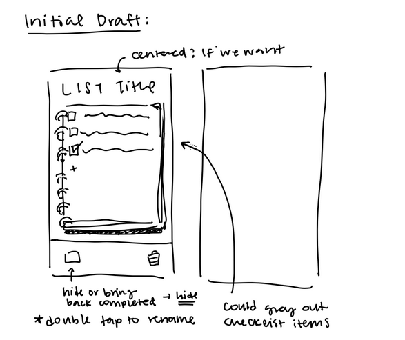
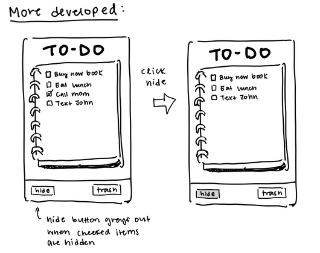

# Design Document

## Initial ideas
Our design started as a a box within the screen you could slide up and down as needed to view the list items  (scroll wheel). 

Then we added buttons below to do the various actions. Specifically the notebook items could be individually selected (shown with highlight) and then the buttons would act on them. We chose 

## Improvements 

Then we started to refine those ideas with physicality and mobile design preferences. Changed the "rename" button into double tapping the names (might need a note to explain it but seems intuitive/conceptually prevalent in mobile design). We also designed the "highlighting" would be connected to a check box and this would be "complete" or not. Moved the new item section to underneath the last item of the list as a plus button. 
We chose to keep delete and show all completed items as seperate buttons to clearly show their intent. If we include an individual delete system it would be a trash can hidden behind a lock (ie only visible when a lock button is pressed)

We added some visual additions by making the scroll box on a notebook image (but without ruled lines so we dont have to line it up)